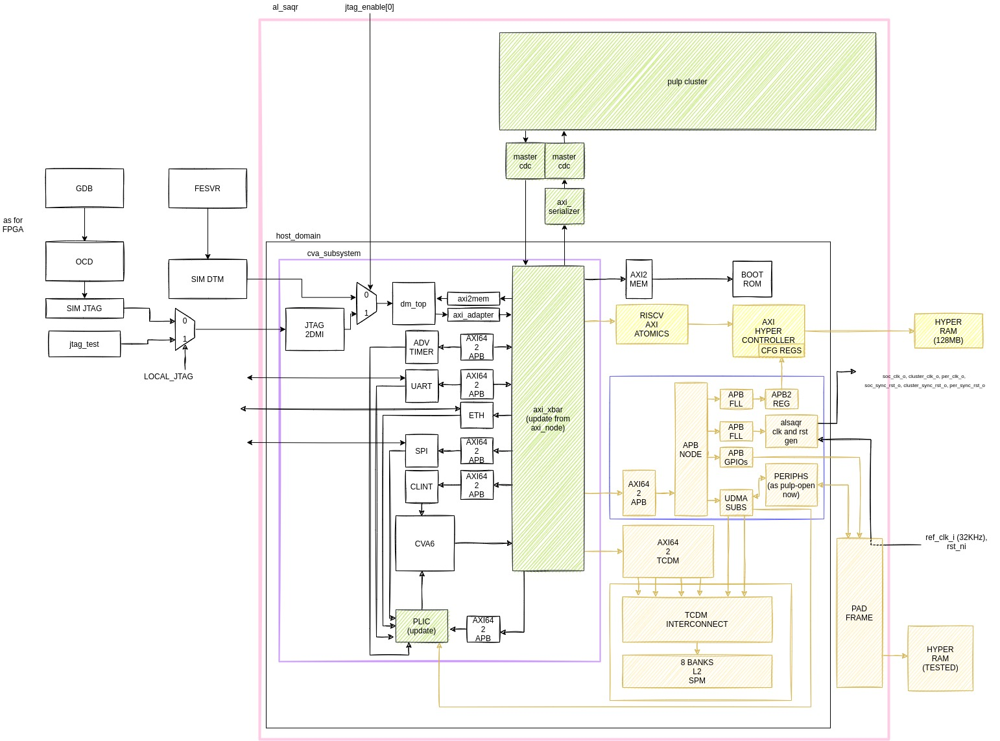

# AlSaqr SoC

This repository contains the hardware files needed to build the AlSaqr-SoC. The architecture of the SoC is briefly described in the block diagram below.



The repository is organized as follows

```
|-- bootrom
|-- fpga 
|-- hardware
|-- software
```

 * The `fpga` folder contains some git submodules.

 * The `hardware` folder is organized as follows:

   - `deps` contains local component integrated in the SoC
   - `host` contains the host-system: it wraps the core and plugs it into the `axi_node` to which the slaves are attached
   - `tb` contains the testbench
   - `fpga` contains the scripts to generate the bitstream
   - `docs` contains the datasheet of AlSaqr SoC and the related padframe specification

 * `software` contains the bare metals tests you can run on the SoC

## Repo initialization
Please change the setup to point to you toolchains and Questasim installations in he-soc/setup.sh):
** NB: this fetches the current master branch, under costant developement. **

```
git clone git@github.com:AlSaqr-platform/he-soc.git
cd he-soc/
source setup.sh
source software/pulp-runtime/configs/pulp_cluster.sh
```
** NB: To target a specific release you should git checkout it as first step after cloning the repo. **
```
git clone git@github.com:AlSaqr-platform/he-soc.git
cd he-soc
git checkout tags/<tag-name> 
source setup.sh
source software/pulp-runtime/configs/pulp_cluster.sh
```

To install, configure bender and download the git dependencies + verification IPs, from he-soc/ run:

```
cd hardware/
make init
```
To compile the hello world, in he-soc/hardware run:

```
make -C ../software/hello_culsans clean all
```

This will generate the binaries and the hyperram*.slm that will be in the rams at t=0 (in case of preloading). 

### Generate TCL for simulation

Then, generate the tcl for simulation and synthesis. In he-soc/hardware run one of two following options accordingly to your target:

* RTL simulation:
```
make scripts_vip
```

* RTL simulation using gf22 macros (this requires the gf22 repository to be cloned and initialized into he-soc/hardware folder, as well as fll's one):
```
make scripts_vip_macro
```
By default, the elf binary will be preloaded into L3.

To load the code through JTAG interface, you can add the `localjtag=1` option to the previous command, for instance: `make localjtag=1 scripts_vip`.
Be aware that the preload of the code is slower in this case.


### Run the test

 * Option 1: in the he-soc/hardware folder run (the test to be run shall be compiled first, as the command runs automatically the simulation with the last tests that has been compiled):

```
make -C ../software/"test you want to run" clean all
make clean sim
```

The code that will be laoded is the last that has been compiled. Thus, to run a test with preload in L3, you shall compile the test you want to run (as shown above) and then run the simulation without providing the path to the binary.

In case of localjtag preload, you need to provide the path to the binary you want to execute. `make clean sim elf-bin=../software/hello_culsans/hello_culsans.riscv` if you used the localjtag preload flag.

 * Option 2: Compilation and execution within the test folder (ex `software/hello_culsans`)

Within `software/testname`, the user can compile the software and build the RTL targeting different configurations, and run the simulation.
The targets are the following:
- linkerscript mapping: L2/L3
- packages: QFN100/CPGA200

The software reuntime contains two linkerscripts under the following paths:

* software/common/test.ld
* software/common/test_l2.ld

The first `test.ld` uses the offchip 256MB L3 memory as main memory, while `test_l2.ld` uses the onchip L2 32KB memory and includes the minimal runtime.

At compile time you can chose the following options to use `test.ld` or `test_l2.ld`:

```
make clean all
```
or
```
make clean all_l2
```

Note that building the RTL for the two packages implies modification to the Testbench only, the SoC does not change!

This SoC development targets 2 prototypes packages:
- QFN100
- CPGA200

The main difference between the two package options is the number of pads exposed.
In the QFN100 only the PHY0 of the Hyperram Controller is attached to external Hyperram memories so we provided additional support that builds the testbench accordingly.

Here are the commands for the targets supported: 

Linker: L3 - Package CPGA200 
```
make clean all rtl 
```
Linker: L2 - Package CPGA200
```
make clean all_l2 rtl_l2 
```
Linker: L3 - Package QFN100
```
make clean all rtl_qfn 
```
Linker: L2 - Package QFN100
```
make clean all_l2 rtl_l2_qfn 
```

To run the simulation you can append `sim` command to the previous examples.

### Run test with OpenTitan:

To run mbox test between cva6 and ibex, in he-soc/hardware run:
```
make -C ../software/mbox_test clean all
make clean sim ibex-elf-bin=./opentitan/sw/tests/alsaqr/mbox_test/mbox_test.elf 
```

To run the full secure boot, use the following commands (for instance, opentitan boots CVA6 which runs an hello world):

```
make scripts_vip sec_boot=1
make -C ../software/hello_culsans/ clean all
make clean sim BOOTMODE=1 sec_boot=1

```
To run the secure boot on CHIP/FPGA, the procedure is a bit more tricky as we do not rely on an external flash.
The steps to be followed are the following:

 * Open 5 terminals (the two openocd + gdb processes for both the JTAG, and the uart screen). I suggest using tmux to handle more terminals from the same window.
 * Preload CVA6 with the desired test (i.e. hello_culsans).
 * Set CVA6 PC to 0x10000, that correspond to the boot address of CVA6 ROM.
 * Run the execution of CVA6 (it must be executing the bootrom to be waken up from OT).
 * Preload OpenTitan with [this binary](https://github.com/AlSaqr-platform/opentitan/blob/122cd13195437362a533e9dd7863a33554f81f83/sw/tests/alsaqr/flash_alsaqr_boot_preload/flash_alsaqr_boot_preload.elf)!
 * The latter binary consists of the flash image (as payload) and a simple fw which instructs ibex to move the payload to the emulated flash (an SRAM).
 * Run this binary and then stop the execution (ctrl+c). You can verify that the content of the Flash (base address is 0xF0000000).
 * To verify the flash has been writte, read back some values starting from 0xF0000480 (the start address, the lower addresses host the manifest) and compare [with this header file](https://github.com/AlSaqr-platform/opentitan/blob/122cd13195437362a533e9dd7863a33554f81f83/sw/tests/alsaqr/flash_alsaqr_boot/bazel-out/flash_alsaqr_boot_signed32.h)!.
 * Now set the PC of Ibex from JTAG to the Bootrom boot address: 0xD0008080.
 * Run the execution of Ibex, starting the secure boot from the bootrom. This will verify the Flash image and jump to it  (this is the last action required).
 * Automatically, the [Flash image](https://github.com/AlSaqr-platform/opentitan/blob/122cd13195437362a533e9dd7863a33554f81f83/sw/tests/alsaqr/flash_alsaqr_boot/flash_alsaqr_boot.c)! writes to the mailbox the boot address for CVA6 (in L3, 0x80000000) and triggers the irq to CVA6 through the mailbox.
 * CVA6 processes the IRQ (Bootrom code) and jumps to the boot address.
 * If you preload hello_culsans, you should see the corresping prints on UART, after running Ibex on its bootrom code.

### Running code on the cluster

To run code on the cluster we must first source its runtime:
```
cd software
source pulp-runtime/configs/pulp_cluster.sh
```
Each test designed for the cluster is structured as follows:
```
- your-test-folder
  |
  |
  -- stimuli
```
The parent folder contains the code executed by the host (CVA6) and the `stimuli` folder contains the cluster code.

You can compile all the needed files with the following commands:
```
cd your-test-folder
make -C stimuli clean all dump_header
make clean all CLUSTER_BIN=1
```
The tests that will run is the last that's been compiled. Thus, compile a test among the ones in software/cluster_regression.list then run the following commands:
```
cd ../../hardware
make scripts_vip
make clean sim
```
### Run regressions

Before merging any modification into the master it is important to run the regression tests to check we did not break anything. To do so, execute the following commands:

To run the regressions including the CVA6 various dual boot mode, FLL bypass and secure boot/mbox test and periphs, run:
```
cd hardware/
make run_regression
```
The tests executed here can be found in `hardware/regressions/regression.csv`, they are 23 and all of them pass.


### FPGA Emulation

We now support emulation on Xilinx VCU118. Please have a look to the README in the `hardware/fpga` folder.


### Synthesize he-soc into your target technology

This requires the gf22 repository to be cloned and initialized into he-soc/hardware folder.
In he-soc/hardware run:

```
make clean scripts-bender-synopsys
```
The command will generate the analyze_alsaqr.tcl within your technology folder

### Post Synthesis Simulations

NB: Due to the padframe modifications this option is under development

The design synthesis of AlSaqr adopts a hierarchical approach. Individual components, such as CVA6, OpenTitan, HyperRAM, PULP Cluster, and FLL, are synthesized independently. However, at the top tier of the design, these submodules are integrated as hard macros, utilizing LEF geometric files alongside lib/db timing views for precision.

To validate the synthesis of AlSaqr we provide the following simulation targets, allowing flexibility and testability:

 * gf22_fll_behav
  
  RTL + FLL BEHAVIOURAL (YOU NEED ACCESS TO THE PRIVATE FLL REPO FOR THIS)

 * post_synth_all

  ONLY NETLSISTS: TOP - FLL - CVA6 -OPENTITAN - CLUSTER - HYPER

 * post_synth_top

  RTL: OPENTITAN - CLUSTER - CVA6  / NETLIST: TOP - FLL - HYPER

 * post_synth_cva6_hyper

  RTL: TOP - CLUSTER - OPENTITAN - FLL BEHAV (YOU NEED ACCESS TO THE FLL REPO FOR THIS)  / NETLIST: CVA6 - HYPER

 * post_synth_cva6_hyper_fll

  RTL: TOP - CLUSTER - OPENTITAN / NETLIST: CVA6 - HYPER - FLL

 * post_synth_fll

  RTL + FLL NETLIST

 * post_synth_top_fll_behav

  RTL + FLL NETLIST

 * post_synth_cva6

  RTL: (USES FLL DUMMY) + CVA6 NETLIST

 * post_synth_opentitan

  RTL (USES FLL DUMMY) + OPENTITAN NETLIST

 * post_synth_cluster

  RTL (USES FLL DUMMY) + CLUSTER NETLIST

 * post_synth_hyper

  RTL (USES FLL DUMMY) + HYPER NETLIST

 
To perform the post sythesis simulation of one of the previous target run the following command within `he-soc/hardware` (NB: the acc flag ensures that the simulation is fast, about 10 mins for an hello world):

```
make clean post_synth=1 <target_name> synth_sim acc=+acc=p+ariane_tb.
```
There is a framwork to run the regressions with the netlist of the chip as well. The netlist regression list is defined in hardware/regressions/regressions_netlist.csv while the transcript of each simulation will be stored in hardware/regressions/regressions_netlist_reports/ . To run the regression using the netlist do the following:

```
cd hardware/
make run_regression_netlist
```

### AlSaqr silicon bringup
This section contains useful information for the AlSaqr bringup.

#### Build the Code for the chip

In addition to the explanation provided above regarding the compilation and execution of tests for different targets (liker/package), we've updated the runtime to support compilation of the code for the AlSaqr chip.
Acordingly to the `bringup/alsaqr.cfg` file, the SoC frequency can be specified (in MHz) at compile time with:

```
make clean chip=1 SOC_FREQ=100 all
```

By default `SOC_FREQ` is 50MHz, so if you change the `bringup/alsaqr.cfg` do not forget to compile the binary specifying the new frequency target. This has impact to the UART baudrate which is fixed to 115200.

#### Openocd
The openocd binary v0.10 is already available in `bringup/openocd`.
