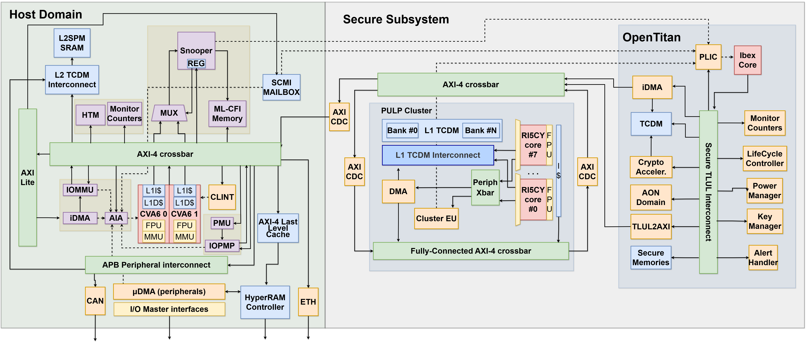

# AlSaqr SoC

This repository contains the hardware files needed to build the AlSaqr-SoC. The architecture of the SoC is briefly described in the block diagram below.




 * The `hardware` folder is organized as follows:

   - `deps` contains local component integrated in the SoC
   - `host` contains the host-system: it wraps the core and plugs it into the `axi_node` to which the slaves are attached
   - `tb` contains the testbench
   - `fpga` contains the scripts to generate the bitstream
   - `docs` contains the datasheet of AlSaqr SoC and the related padframe specification 

 * `software` contains the bare metals tests you can run on the SoC

## RISC-V Toolchain

AlSaqr requires the RISC-V toolchain which is available here: https://github.com/riscv-collab/riscv-gnu-toolchain

For the PULP CLuster make sure the PULP RV32 toolchain is in your PATH. Please refer to PULP RISCV GCC toolchain to use a pre-built release: https://github.com/pulp-platform/pulp-riscv-gcc

## Repo initialization
Please change the setup file to point to your toolchains and Questasim installations in he-soc/setup.sh:

** NB: this fetches the current master branch, under costant developement. **

```
git clone git@github.com:AlSaqr-platform/he-soc.git
cd he-soc/
source setup.sh
source software/pulp-runtime/configs/pulp_cluster.sh
```
** NB: To target a specific release you should git checkout it as first step after cloning the repo. **
```
git clone git@github.com:AlSaqr-platform/he-soc.git
cd he-soc
git checkout tags/<tag-name> 
source setup.sh
```

Two IPs from Infineon must be downloaded manually, as they require to create an account on Infineon website and log-in. The two IPs are [hyperram_models](https://www.infineon.com/dgdl/Infineon-S27KL0641_S27KS0641_VERILOG-SimulationModels-v05_00-EN.zip?fileId=8ac78c8c7d0d8da4017d0f6349a14f68) and [spi_flash](https://www.infineon.com/dgdl/Infineon-S25fs256s-SimulationModels-v02_00-EN.zip?fileId=8ac78c8c7d0d8da4017d0f6251a24e7b). 

In Makefile, the variable VIPS_ROOT must be updated with the location of your VIPs directory. For those who have already worked with this repository, it is enough to copy somewhere outside the direcoty the VIPs dir, and provide as VIPS_ROOT its location. 

For those approaching for the first time this setup, you need to create a directory "vips" somewhere in your /home/ and copy into that the hyperram models and spi flash models. The structure must be the following:

```
vips
|-- spi_flash
|----- s25fs256s.v
|----- s25fs256s_verilog.sdf
|-- hyperram_model
|----- s27ks0641.v
|----- s27ks0641_verilog.sdf
```

After configuring the vips directory and updating the VIPS_ROOT variable pointing to it, you can proceed with initialization command:

```
cd he-soc/hardware/
make init
```
make init step may fail on slower networks as connection breaks before getting all repositories.
Repeat 'make init' step until all repositories downloaded and bender lock generated.

To compile the hello world, in he-soc/hardware run:

```
make -C ../software/hello_culsans clean all
```
To compile the hello world for FPGA board, in he-soc/hardware run:

```
make -C ../software/hello_culsans fpga=1 clean all
```
This will generate the binaries and the hyperram*.slm that will be in the rams at t=0 (in case of preloading). 
 
### Generate TCL for simulation

Then, generate the tcl for simulation and synthesis. In he-soc/hardware run one of two following options accordingly to your target:

* RTL simulation:
```
make scripts_vip
```

* RTL simulation using gf22 macros (this requires the gf22 repository to be cloned and initialized into he-soc/hardware folder, as well as fll's one):
```
make scripts_vip_macro
```
By default, the elf binary will be preloaded into L3.

To load the code through JTAG interface, you can add the `localjtag=1` option to the previous command, for instance: `make localjtag=1 scripts_vip`.
Be aware that the preload of the code is slower in this case.


### Run the test

 * Option 1: in the he-soc/hardware folder run (the test to be run shall be compiled first, as the command runs automatically the simulation with the last tests that has been compiled):

```
make -C ../software/"test you want to run" clean all
make clean sim
```

The code that will be laoded is the last that has been compiled. Thus, to run a test with preload in L3, you shall compile the test you want to run (as shown above) and then run the simulation without providing the path to the binary.

In case of localjtag preload, you need to provide the path to the binary you want to execute. `make clean sim elf-bin=../software/hello_culsans/hello_culsans.riscv` if you used the localjtag preload flag.

 * Option 2: go to the test folder (ex `software/hello_culsans`)
 
```
make clean all sim
```

### Run the test in L2

To run tests in L2, you compile for L2 and then disconnect the L3 with following commands and flags:
```
make -C ../software/hello_culsans clean all_l2
make scripts_vip exclude-l3-tb=1 localjtag=1 elf-bin=<path-to-test.riscv> clean sim
```
The code must be preloaded into L2 via JTAG.


### Run test with OpenTitan:

To run mbox test between cva6 and ibex, in he-soc/hardware run:
```
make -C ../software/mbox_test clean all
make clean sim ibex-elf-bin=./opentitan/sw/tests/alsaqr/mbox_test/mbox_test.elf 
```

To run the full secure boot, use the following commands (for instance, opentitan boots CVA6 which runs an hello world):

```
make scripts_vip sec_boot=1
make -C ../software/hello_culsans/ clean all
make clean sim BOOTMODE=1 sec_boot=1

```
The sec_boot=1 flag can be used to prevent CVA6 from booting (to run tests on OpenTitan as a standalone environment)

### Run regressions

Before merging any modification into the master it is important to run the regression tests to check we did not break anything. To do so, execute the following commands:

To run the regressions including the CVA6 boot, FLL, secure boot/mbox test and periphs, run:
```
cd hardware/
make run_regression
```

### FPGA Emulation

We now support emulation on Xilinx VCU118. Please have a look to the README in the `hardware/fpga` folder.


### Synthesize he-soc into your target technology

This requires the gf22 repository to be cloned and initialized into he-soc/hardware folder.
In he-soc/hardware run:

```
make clean scripts-bender-synopsys
```
The command will generate the analyze_alsaqr.tcl within your technology folder

### Post Synthesis Simulations

NB: Due to the padframe modifications this option is under development

The design synthesis of AlSaqr adopts a hierarchical approach. Individual components, such as CVA6, OpenTitan, HyperRAM, PULP Cluster, and FLL, are synthesized independently. However, at the top tier of the design, these submodules are integrated as hard macros, utilizing LEF geometric files alongside lib/db timing views for precision.

To validate the synthesis of AlSaqr we provide the following simulation targets, allowing flexibility and testability:

 * gf22_fll_behav
  
  RTL + FLL BEHAVIOURAL (YOU NEED ACCESS TO THE PRIVATE FLL REPO FOR THIS)

 * post_synth_all

  ONLY NETLSISTS: TOP - FLL - CVA6 -OPENTITAN - CLUSTER - HYPER

 * post_synth_top

  RTL: OPENTITAN - CLUSTER - CVA6  / NETLIST: TOP - FLL - HYPER

 * post_synth_cva6_hyper

  RTL: TOP - CLUSTER - OPENTITAN - FLL BEHAV (YOU NEED ACCESS TO THE FLL REPO FOR THIS)  / NETLIST: CVA6 - HYPER

 * post_synth_cva6_hyper_fll

  RTL: TOP - CLUSTER - OPENTITAN / NETLIST: CVA6 - HYPER - FLL

 * post_synth_fll

  RTL + FLL NETLIST

 * post_synth_top_fll_behav

  RTL + FLL NETLIST

 * post_synth_cva6

  RTL: (USES FLL DUMMY) + CVA6 NETLIST

 * post_synth_opentitan

  RTL (USES FLL DUMMY) + OPENTITAN NETLIST

 * post_synth_cluster

  RTL (USES FLL DUMMY) + CLUSTER NETLIST

 * post_synth_hyper

  RTL (USES FLL DUMMY) + HYPER NETLIST

 
To perform the post sythesis simulation of one of the previous target run the following command within `he-soc/hardware` (NB: the acc flag ensures that the simulation is fast, about 10 mins for an hello world):

```
make clean post_synth=1 <target_name> synth_sim acc=+acc=p+ariane_tb.
```
There is a framwork to run the regressions with the netlist of the chip as well. The netlist regression list is defined in hardware/regressions/regressions_netlist.csv while the transcript of each simulation will be stored in hardware/regressions/regressions_netlist_reports/ . To run the regression using the netlist do the following:

```
cd hardware/
make run_regression_netlist
```
## Pubblication

If you use AlSaqr in your work, please cite us:

```
@ARTICLE{10423921,
  author={Valente, Luca and Nadalini, Alessandro and Veeran, Asif Hussain Chiralil and Sinigaglia, Mattia and Sá, Bruno and Wistoff, Nils and Tortorella, Yvan and Benatti, Simone and Psiakis, Rafail and Kulmala, Ari and Mohammad, Baker and Pinto, Sandro and Palossi, Daniele and Benini, Luca and Rossi, Davide},
  journal={IEEE Transactions on Circuits and Systems I: Regular Papers}, 
  title={A Heterogeneous RISC-V Based SoC for Secure Nano-UAV Navigation}, 
  year={2024},
  volume={},
  number={},
  pages={1-14},
  keywords={Standards;Energy efficiency;Drones;Virtual machine monitors;Silicon;Navigation;Internet of Things;Heterogeneous;Linux;low-power;autonomous nano-UAVs;RISC-V},
  doi={10.1109/TCSI.2024.3359044}}

@INPROCEEDINGS {10254698,
author = {L. Valente and A. Veeran and M. Sinigaglia and Y. Tortorella and A. Nadalini and N. Wistoff and B. Sa and A. Garofalo and R. Psiakis and M. Tolba and A. Kulmala and N. Limaye and O. Sinanoglu and S. Pinto and D. Palossi and L. Benini and B. Mohammad and D. Rossi},
booktitle = {2023 IEEE Hot Chips 35 Symposium (HCS)},
title = {Shaheen: An Open, Secure, and Scalable RV64 SoC for Autonomous Nano-UAVs},
year = {2023},
volume = {},
issn = {},
pages = {1-12},
abstract = {Open Source Hardware, the way it should be!},
keywords = {},
doi = {10.1109/HCS59251.2023.10254698},
url = {https://doi.ieeecomputersociety.org/10.1109/HCS59251.2023.10254698},
publisher = {IEEE Computer Society},
address = {Los Alamitos, CA, USA},
month = {aug}
}

```
