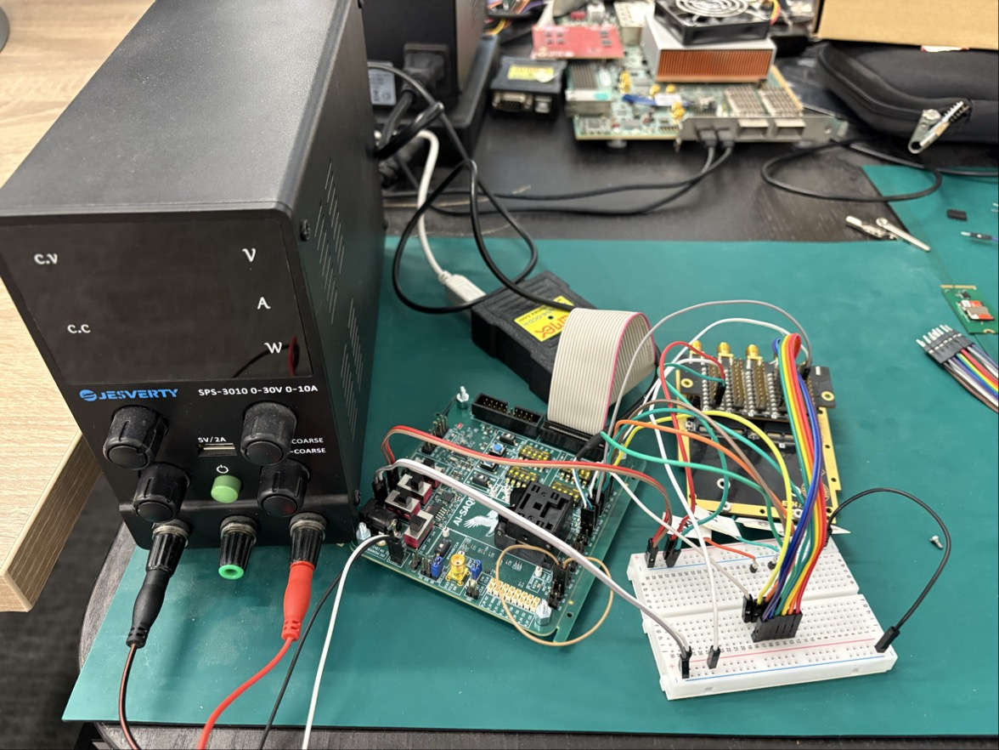
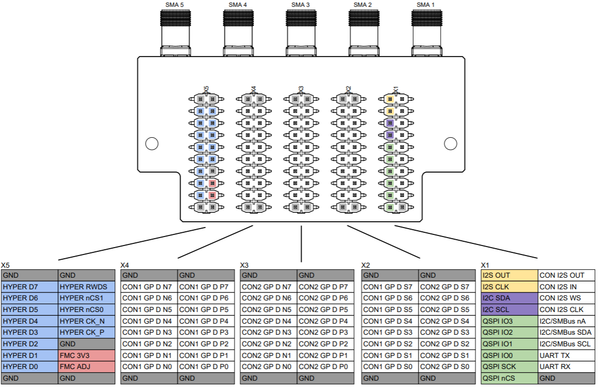
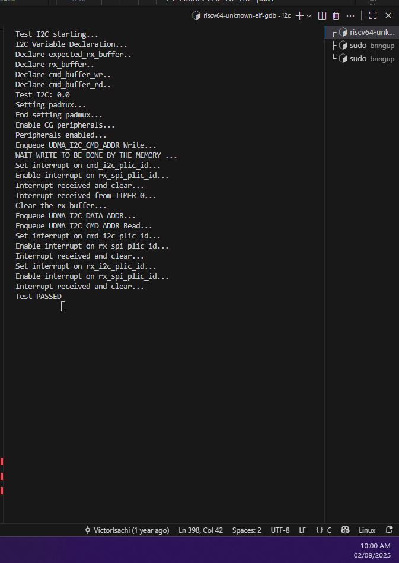
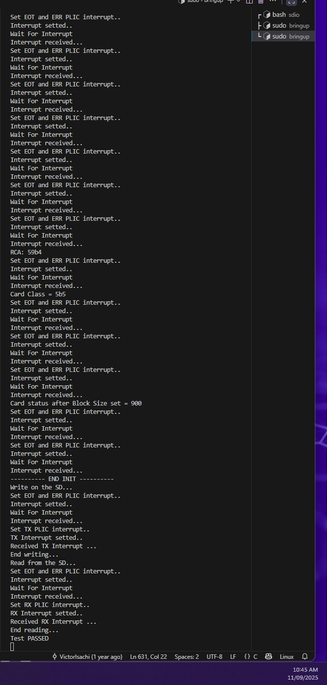
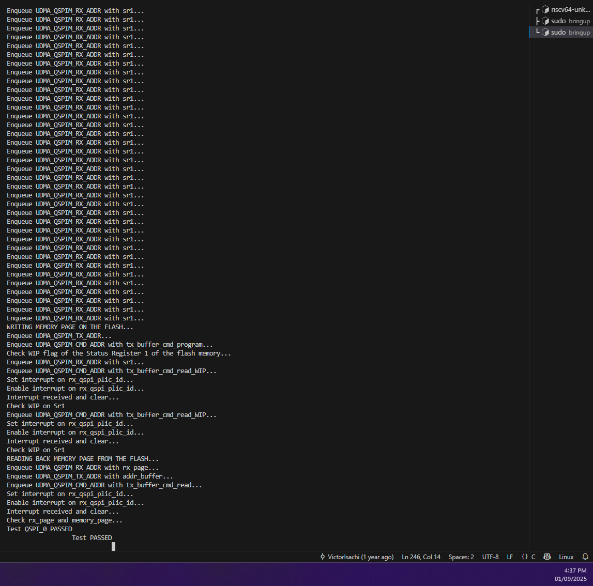
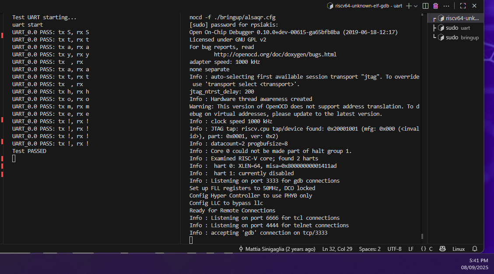

# Peripherals Bring-up — Master Quick Reference & Padframe Rationale (QFN)


## Quick start (one-liner)
```bash
# L2 build targeted to QFN bring-up (CHIP_BRINGUP sets padframe-B exclusion and places all code in L2)
make clean chip=1 SOC_FREQ=100 all_l2
```

- `chip=1` → `-DCHIP_BRINGUP` (excludes padframe B code, enables QFN/bringup paths).
- `SOC_FREQ=100` → SoC reference frequency for runtime code.
- `all_l2` → code mapped to L2 (32 KB) — recommended if HypeRam (L3) is not operational.

---

## Short pre-power checklist
1. Confirm QFN wiring: padframe B pins should not be physically present on QFN.
2. Verify power rails and common ground between chip and external devices.
3. Connect UART TX/RX to host for console logs.
4. Ensure board has external pull-ups for I2C (recommended 4.7 kΩ); if not, be ready to enable internal pull-ups.
5. Choose correct build flags (`FPGA_EMULATION` vs `CHIP_BRINGUP`), see Makefile notes below.

---

# Part A — Build & Makefile

### Important `make` invocation for L2 on QFN
```bash
make clean chip=1 SOC_FREQ=100 all_l2
```

- `chip=1` → defines `CHIP_BRINGUP` and `-DSOC_FREQ=$(SOC_FREQ)` into compiler flags.
- `SOC_FREQ` (e.g. 100 MHz) adjust according to selected FLL frequency in alsaqr.cfg.
- `all_l2` produces a binary with the lightweight runtime suitable for L2 mapping (32 KB).

### Useful Makefile flags
- `CHIP_BRINGUP` — used to exclude padframe B functions for QFN packages.

### SRC / INC notes
- L2 build uses a reduced set of includes and sources (`INC_L2`, `SRC_L2`) — ensure UART,USART, SPI, padframe, and minimal UDMA drivers are included for your tests.

---

# Part B — Padframe (CFG + MUX_SEL)
>Check in: hardware/deps/alsaqr_periph_padframe/src/alsaqr_periph_padframe_periphs_regs.hjson

Each pad typically exposes two main registers (names vary with vendor prefixes):

- `A_xx_CFG` — pad configuration register (drive strength, pull-up, output enable, Schmitt, etc.).
- `A_xx_MUX_SEL` — multiplex select: chooses which internal port is connected to the pad.

### Important `A_xx_CFG` fields (!!!JUST FOR YOU INFO!!!)
- `chip2pad` (bit 0): connects the SoC TX driver to the pad when set.
- `drv` (bits 2:1): drive strength (0..3).
- `oen` (bit 3): **output enable (active LOW)**. `oen = 0` → output enabled; `oen = 1` → output disabled (Hi-Z). Default `resval = 1` (Hi-Z).
- `puen` (bit 4): **pull-UP enable (active LOW)**. `puen = 0` → internal pull-up enabled; `puen = 1` → pull-up disabled. Default `resval = 1` (no internal pull-up).
- `slw` (bit 5): slew control (slow/fast).
- `smt` (bit 6): Schmitt trigger enable for inputs.

**Rule of thumb**:
- For driven outputs (TX): `chip2pad = 1`, `oen = 0`.
- For open-drain / I2C style lines: prefer external pull-ups; only enable `puen` if necessary.
- For noisy inputs: enable `smt`.

### `A_xx_MUX_SEL` (how to pick peripheral)
`MUX_SEL` enumerates the functions that can be connected to the pad. Example enum entries:
- `0` → `register` (no peripheral)
- `1` → `port_can0_can_tx`
- `2` → `port_gpio_b_gpio0`
- `3` → `port_uart_core_uart_tx`
- `4` → `port_sdio0_sdio_data0` (example)

**Important**: the numeric value assigned to a function is *pad-dependent*. Always consult the alsaqr_periph_padframe_periphs_regs.hjson file to map a desired peripheral to the correct numeric value for that pad.

---

### Example — Why for e.g. SDIO padmux choices in sdio.c make sense (analysis & mapping)

We configured:
```c
alsaqr_periph_padframe_periphs_a_02_mux_set(4);
alsaqr_periph_padframe_periphs_a_03_mux_set(4);
alsaqr_periph_padframe_periphs_a_04_mux_set(4);
alsaqr_periph_padframe_periphs_a_05_mux_set(3);
alsaqr_periph_padframe_periphs_a_06_mux_set(3);
alsaqr_periph_padframe_periphs_a_07_mux_set(3);
```

From the alsaqr_periph_padframe_periphs_regs.hjson:
- `A_02_MUX_SEL` (bits `2:0`) has enum value `4` → `port_sdio0_sdio_data0`.
- `A_03_MUX_SEL` value `4` → `port_sdio0_sdio_data1`.
- `A_04_MUX_SEL` value `4` → `port_sdio0_sdio_data2`.

So selecting `4` on a_02..a_04 explicitly maps SDIO `DATA0..DATA2` to those physical pads. We set `a_05..a_07` to `3` because on those pads the `3` index selects the SDIO function available on them (for example, `CMD`, `CLK` or `DAT3`) — **always verify** against the alsaqr_periph_padframe_periphs_regs.hjson for those pads. The numeric indices are not universal: `3` on `a_05` might mean `qspi_csn` on a different pad, but on your silicon it selects the SDIO function available there.

---

# Part C — Peripheral testing

## Common build defines (recommended)
- FPGA emulation safe defaults:
  ```text
  -DFPGA_EMULATION
  ```
- Early chip bring-up for QFN:
  ```text
  -DCHIP_BRINGUP
  ```
**Note**: Only one of `FPGA_EMULATION`, `SIMPLE_PAD`, `CHIP_BRINGUP` should be active for padmux/clock choices. Use `#if defined(...) || defined(...)` in code where needed.

## Clock divider recommendations (safe starting values)
- **UART** : aim for 115200 baud (compute divider from SoC clock).
- **USART**: aim for 115200 baud (compute divider from SoC clock).
- **SPI**: start with `divider = 128` (safe in FPGA/QFN bring-up).
- **I2C**: start with `divider ≈ 1920` (safe for ~100 kHz).
- **SDIO**: MUST start slow with `divider = 1920`.

## Padmux — **must** set BEFORE enabling peripheral (or starting transactions)
```c
// UART
set_padmux(UART_PADS);
// USART
set_padmux(USART_PADS);
// SPI
set_padmux(SPI_PADS);
// I2C
set_padmux(I2C_PADS);
// SDIO
set_padmux(SDIO_PADS);
```

## Hardware configuraion
### Testbech

### Connections
FMC Test Module:

- Connect this FMC Test Module on the FMC board through the FMC connector and connect the `FMC 3v3` and `FMC ADJ` to Al Saqr board's `3.3V` and `1.8V` supply (`J22`,`J23` off)
- Connect Al Saqr board's `GND` to one of the `GND` pins of the FMC Test Module.
- If device requires VCC, ensure proper level (e.g. 3.3V, 1.8V) and common ground.

UART:
- Al Saqr board TX -\> Al Saqr board RX

USART:
- Al Saqr board USART_TX -\> Al Saqr board USART_RX
- Al Saqr board USART_RTS -\> Al Saqr board USART_CTS


SPI (peripheral):
- Al Saqr board MOSI -\> FMC Test Module QSPI IO1
- Al Saqr board MISO -\> FMC Test Module QSPI IO0
- Al Saqr board SCK -\> FMC Test Module QSPI SCK
- Al Saqr board CSN -\> FMC Test Module QSPI nCS

I2C (peripheral):
- Al Saqr board SDA -\> FMC Test Module I2C SDA (pull-ups already on board)
- Al Saqr board SCL -\> FMC Test Module I2C SCL (pull-ups already on board)
- Address pins on device must be set as expected (A0/A1/A2)

SDIO (SD card / eMMC):
- Al Saqr board CMD -\> FMC Test Module CON1 GP D S0
- Al Saqr board CLK -\> FMC Test Module CON1 GP D S1
- Al Saqr board DAT0 -\> FMC Test Module CON1 GP D S2
- Al Saqr board DAT1 -\> FMC Test Module CON1 GP D S3
- Al Saqr board DAT2 -\> FMC Test Module CON1 GP D S4
- Al Saqr board DAT3 -\> FMC Test Module CON1 GP D S5
>Note: For SDIO, use the slow init clock and verify card presence/power.

---
# Part D — Bringup Evaluation and expected result






# Part E — Debugging & Troubleshooting (practical)

1. **Padmux wrong** → bus floating → reads 0xFF or responses 0xFFFF. Fix: set `MUX_SEL` for each pad to the correct function using the SVD enum values.
2. **Divider too small (clock too fast)** → devices don’t respond; symptoms: repeated PLIC claims, timeouts, garbage data. Fix: raise divider (e.g. SDIO/I2C to 1920) during init.
3. **Missing pull-ups on I2C** → lines float high; symptom: NACKs and 0xFF reads. Add 4.7kΩ pull-ups or enable internal `puen` (active LOW) if nothing else works.
4. **Interrupt loops** → ensure you clear peripheral status bits (e.g., `UDMA_SDIO_STATUS`) and write `PLIC_CHECK` to acknowledge.
5. **EEPROM write not visible** → ACK-poll rather than fixed short timer; page writes may take ms-level time to commit.
6. **RX buffer shows old data** → clear buffers before enqueuing DMA transfers.

---
---

Author: Rafail Psiakis\
Contact: rafail.psiakis@ti.ae\
Date: 11/09/25