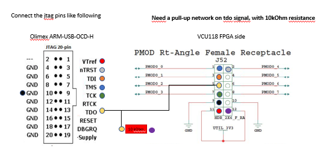
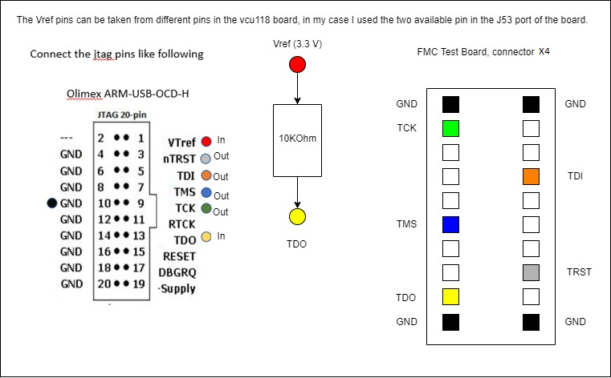

# FPGA Emulation

We now support emulation on the VCU118. For fpga emulation, you can choose if you want to plug which `axi_slave` you prefer to the `axi_xbar`: either the `hyperbus memory controller` or the `Xilinx DDR4 AXI IP` that uses the onboard DDR4.

To rely on the hyperbus, you need a [special FMC carrier board](https://ieeexplore.ieee.org/document/9607006). Also, when using the DDR we can push the design to 50MHz. When relying on the Hyperbus, our upper limit is 10MHz.

## Bitstream generation

To generate the bitstream, with a DDR configuration (the one available in VCU118 board), run:

```
make simple-padframe=1 scripts-bender-fpga-ddr simple-padfrane=1

```
To use the hyperram use `make scripts-bender-fpga`, without simple-padframe.

You can also use the `exclude-cluster=1`, `exclude-rot=1` and `exclude-llc=1` option, in case you don't want to emulate the cluster/opentitan/llc as well.

```
cd fpga

source ./setup.sh
```
 * Select VCU118. The ZCU102 is already too small to fit ariane and the cluster. We will provide support for the ZCU102 as well in the future, with a reduced version of the cluster.
 * Unless you specified the `exclude-llc` when generating the compile script, you are instantiating it (the same holds for OpenTitan)!
 * Choose the memory
 * If you choose the hyperram, you can't validate the peripherals. Otherwise you can. Apparently, it's better to instantiate the padframe: it help Vivado with placement, so just say you are also validating the peripherals if you are using the DDR4. 

```
make ips

make clean run
```
Vivado IPs shall be generated only once at the first synthesis (unless modifications to the ROMs or to clk frequency are applied)

## Running code on CVA6 only

If your goal is to run/debug code uniquely from CVA6, you can connect only its JTAG without connecting OpenTitan one. 

NB: if both are connected and for instance you don't use CVA6/OpenTitan one, this will not affect the behaviour of the system. They can be considered as two completely independent systems. 

Remark: OpenTitan (and thus its JTAG) has full visibility on CVA6 memory map, while CVA6 has NO access at all to OpenTitan system, it can only send commands to OpenTitan through the mailbox.

As of now, to interface with Alsaqr on FPGA we use [openocd](https://github.com/riscv/riscv-openocd). The debugger we use is [this one](https://www.olimex.com/Products/ARM/JTAG/ARM-USB-OCD-H/).

The CVA6 JTAG is connected to the PMOD0 port (J52 connector) of the VCU118 (refer to the baord's documentation to find it). The connections between the Olimex and the PMOD0 port are shown in the followin image.



NB: the two openocd config files for Ibex and CVA6 contains a command, ftdi_serial, where we specify the ID of the specific Olimex we use. This is needed because we are using two of them together, and we need to guarantee that we connect properly to the correct JTAG. You shall modify it with the IDs of yours.


To run a test:

 * Open the hw manager and load the bitstream
 * Open 3 terminals:

### Terminal 1

```
openocd -f ariane.cfg
```
### Terminal 2

```
screen -L /dev/ttyUSBi 115200
```
### Terminal 3

```
riscv64-unknown-elf-gdb <path-to-compiled-elf-for-cva6>
from gdb terminal
(a) target remote :3333
(b) monitor reset halt
(c) load
(d) c
```
At this point you are supposed to see the uart prints on the screen. 

## Running code on OpenTitan

To run code on OpenTitan, the passages are basically the same, with the difference that we will use a different JTAG port. The OpenTitan JTAG is mapped to the FMC connector. The board does not expose any pin from the FMC connector, thus an expansion board is required. This board will be connected to the FMC connector, exposing pins from it. The expansion board is the FMC Test Module, developed by ETH and Unibo. OpenTitan's JTAG is mapped to the X4 connector of the Test Module, the connections are shown below.



Then, to run a test on OpenTitan, load the bitstream, open 3 terminals and run:

### Terminal 1

```
openocd -f ibex.cfg
```
### Terminal 2

```
screen -L /dev/ttyUSBi 115200
```
### Terminal 3

```
riscv64-unknown-elf-gdb <path-to-compiled-elf-for-ibex>
from gdb terminal
(a) target remote :1111
(b) monitor reset halt
(c) load
(d) c
```

## Running code on CVA6 and Ibex together

As said before, the two systems are basically independent. Thus we can easily connect to both the JTAGs together. We will require 5 terminals (I strongly suggest to use tmux to handle all the terminals in one only window). The test is of course splitted in two executale, one for OpenTitan and one for CVA6, which shall be laoded through the respective JTAG interfaces. The test is developed in such a way that we shall execute OpenTitan (which will wait for the mbox irq) and then CVA6, which will raise the irq to OpenTitan.

Here, you can find the passages to run the mailbox-based communication test, between Ibex and CVA6:

 * Open the hw manager and load the bitstream
 * Open 3 terminals:

### Terminal 1

```
screen -L /dev/ttyUSBi 115200
```

### Terminal 2

```
openocd -f ibex.cfg
```

### Terminal 3

```
openocd -f ariane.cfg
```

### Terminal 4

```
riscv64-unknown-elf-gdb <path-to-ibex-mbox-executable>
from gdb terminal
(a) target remote :1111
(b) monitor reset halt
(c) load
(d) c
```

### Terminal 5

```
riscv64-unknown-elf-gdb <path-to-cva6-mbox-executable>
from gdb terminal
(a) target remote :3333
(b) monitor reset halt
(c) load
(d) c
```
At this point, you should see the prints from Ibex and CVA6 to the screen terminal.

## Install OpenOCD

```
git clone https://github.com/riscv/riscv-openocd.git
cd riscv-openocd
git checkout 3249d415595ee430164aa0429bcc7452c0f251fa
./bootstrap
./configure --enable-jtag_vpi --enable-jtag_dpi --enable-remote-bitbang --enable-fdti enable-ftdi-oscan1 --prefix=/path/to/install
make
make install
```
