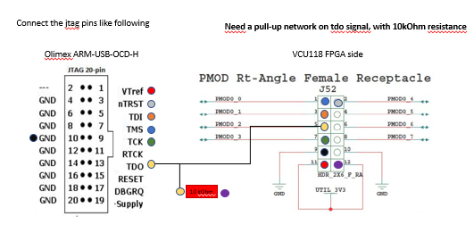

# FPGA Emulation: Opentitan Integraton

## The SCMI mailbox test

The test is setup to perform secure communication between the host core, Ariane, and the RoT core, Ibex. The communication happens throught a shared memory containing control - status registers compliant with the SCMI protocol.
The shared memory is implemented with a regfile.
The test is begins with the Ibex core, it is supposed to be the first to run. It performs some r/w to the mailbox and prints a message if the readback values correspond to what has been written. Then, Ibex goes in "wait for interrupt".
At this point, Ariane, via gdb command, starts the communication test. It performs as well some write and checks whether the reads correspond to the writes, rings the doorbell and goes in wait for (completion) interrupt as well.
Ibex then receives the irq from the mailbox and starts the IRQ Handler which is in charge to read the mailbox regs and compare the values with the ones Ariane has written. If they match, Ibex raises the completion interrupt writing the correspondent register
of the mailbox and goes back to wfi. Ariane receives the completion interrupt, whose IRQ Handler prints out a message and return. If the execution flow arrives to the final print by Ariane the test has succeeded.
If some communication errors are present between the cores or with tha mailbox, the code never arrives to the final "test succeeded" print because either an error is printed (for r/w mismatches) or either one or both the cores doesn't exit from wfi and the succeed message can't be printed.

## JTAG ports configuration

In the FPGA synthesis, the JTAG ports of both the cores are indipendently mapped to the i/o of the FPGA. In particular, the Ariane JTAG port is mapped to the J52 port of the vcu118 board, while the Ibex JTAG port is mapped to the
J2 port, that implements the reduced FMC protocol. To access the FMC pins, the FMC Test Module (by ETH Zurich) have to be connected to the J2 connector (n°34 in the figure 2-1 at page 12 of the vcu118 board documentation).
The FMC Test Module presents 5 ports with 16 pins (and 4 GND pins) each. In the pictures below the connections between the X2 connector of the FMC Test Module and the Olimex are shown, as well as the ones between the J52 port and the other Olimex.

The .cfg files to be used in openocd are the same for both the cores with the exception of the Olimex Serial Numbers and the remote ports for the gdb connections. There are two config files, ariane.cfg and ibex.cfg.
Those cfg file have to be changed according to the Olimex Serial Numbers. The command usb-devices shows information about the usb peripherals connected to the PC hosting the board. The easiest way is to connect one Olimex by time and run usb-devices command.

## Ariane JTAG - Olimex Connections


## Ibex JTAG - Olimex Connections


## Running the Test

The code for Ariane is located at "root-of-cva6-repo"/software/hello/hello.riscv while the code for Ibex is located at "root-of-cva6-repo"/hardware/.bender/git/checkouts/opentitan/sw/mailbox_test/hello_test.elf .
To run the test, open the hw manager and load the bitstream. Then open 5 terminals as follows:

### Terminal 1: openOCD for Ariane
```
openocd -f <path-to-cfg-files>/ariane.cfg
```
### Terminal 2: openOCD for Ibex
```
openocd -f <path-to-cfg-files>/ibex.cfg
```
### Termianl 3: gdb for Ariane
```
riscv64-unknown-elf-gdb <path-to-compiled-elf>/hello.riscv
```
### Terminal 4: gdb for Ibex
```
riscv64-unknown-elf-gdb <path-to-compiled-elf>/hello_test.elf
```
### Terminal 5: screen for the prints
```
screen -L /dev/ttyUSBi 115200
```

At this point, both the openocd processes should be connected to the JTAG ports and should be ready to accept the gdb connection at the ports :1111 for Ibex and :3333 for Ariane. Then:

### Terminal 3: connecting gdb to Ariane
```
target remote :3333
monitor reset halt
load
```
### Temrinal 4: connecting gdb to Ibex
```
target remote :1111
monitor reset halt
load
```

The codes are now loaded to the RAM memories and the PCs are set to the boot address. To launch the test:

### Terminal 4: run Ibex
```
continue
```
### Temrinal 3: run Ariane
```
continue

```
The terminal 5 with the uart screen should now show the prints of the test. The test can be repeated by resetting the cores (monitor reset halt + laod + continue in both gdb processes)